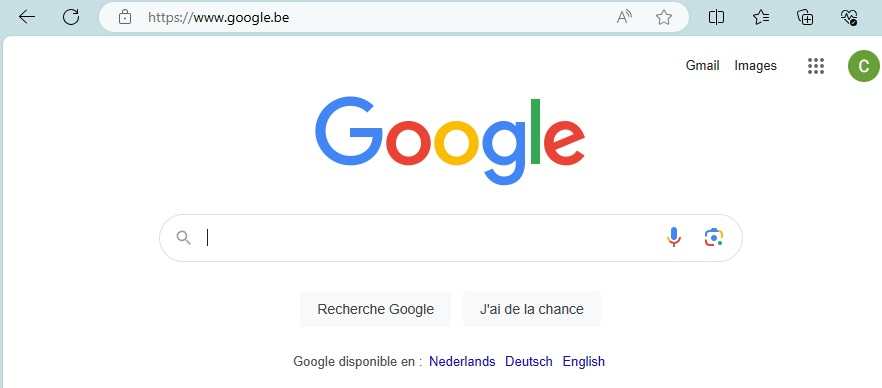

# Comment fonctionne internet ?

## Introduction  
Nous savons tous utiliser internet. Pour nous, c'est aussi simple que de cuisiner un plat de pâtes. Peut-être même encore plus simple !  

Mais savons-vous vraiment ce qu'il y a derrière ? Quels sont les mécanismes qui permettent, lorsque l'on tape https://www.google.be sur notre ordinateur, de voir apparaitre instantanément sur notre écran cette page si bien connue :

Et ce, à une telle vitesse, que l'on ne se pose même plus la question !

C'est parti pour une petite explication !

## Alors d'abords, Internet, c'est quoi, concrètement ?

Non non non et non. Internet, ce n'est pas le cloud. On va revenir à des basics :

Internet, c'est d'abords et avant tout un fil. Qu'il soit enfoui dans le sol, qu'il s'agisse de fibre optique, de cuivre ou occasionnellement de transmission vers des satellites ou via des réseaux de téléphonie mobile, mais Internet n'est qu'un fil.

Et son intéret principal, c'est qu'il permet à deux ordinateurs connectés directement à ce "fil" de communiquer.

## Ensuite, qu'est-ce qu'un serveur ?

Un serveur est un ordinateur spécial connecté directement à Internet. Chaque serveur possède une adresse de protocole Internet unique (adresse IP). Tout comme une adresse postale, les adresses IP aident les ordinateurs à se retrouver. Mais comment retrouver un ordinateur dont l'adresse est 72.14.205.100. Pas évident avec un nom comme ça. Alors, on leur a donné des noms comme google.com ou facebook.com.

> *Ok, mais mon ordinateur, c'est un serveur ?*  
> *Non, l'ordinateur que vous utilisez à la maison ou au travail n’est pas un serveur : il n’est pas directement connecté à Internet.*

## La notion de client
> *OK, mais si ce n'est pas un serveur, qu'est-ce c'est alors ?*

Eh bien, les ordinateurs que nous utilisons quotidiennement sont appelés « **clients** », car ils sont connectés indirectement à Internet, via un fournisseur de services Internet.

### Un exemple pour illustrer ce qu'on vient de voir ?

Mon ordinateur se connecte à aol.com et je peux consulter ses pages Web. Supposons que je souhaite envoyer un mail à Tata Jacqueline. Je me connecte à gmail.com et rédige un message à l'adresse e-mail de tante Ruth. Une fois que je clique sur "Envoyer", gmail.com envoie l'e-mail à aol.com. Le lendemain, tante Ruth se connecte aux serveurs d'AOL et récupère l'e-mail.

## Mais les infos qu'on envoie peut être très lourdes
Exactement. Et c'est pour ça que nous allons voir maintenant la notion de paquets.

Chaque fois qu'un e-mail, une image ou une page Web circule sur Internet, les ordinateurs divisent l'information en morceaux plus petits appelés paquets. Lorsque les informations atteignent leur destination, les paquets sont réassemblés dans leur ordre d'origine pour créer une image, un e-mail, une page Web ou un tweet.

## La notion de routers
Alors imaginez que vous êtes au travail, assis à côté de votre patron et que vous surfez tous les deux en ligne. Votre patron fait une étude de marché; de votre côté, vous mettez à jour votre profil Facebook.

Eh bien, vous envoyez tous les deux des paquets sur Internet. Mais comment empêcher vos paquets de se retrouver accidentellement sur l'écran de votre patron ? 

La solution à ce problème réside dans les fameuses adresses IP dont nous avons déjà discutées, et les routeurs. Tout ce qui est connecté directement ou indirectement à Internet possède une adresse IP. Tout.

Cela inclut votre ordinateur, vos serveurs, vos téléphones portables et tout l’équipement intermédiaire. Partout où deux ou plusieurs parties d’Internet se croisent, il existe un équipement appelé routeur.

Les routeurs dirigent vos paquets sur Internet, aidant chaque paquet à se rapprocher de sa destination.

Chaque fois que vous visitez un site Web, jusqu'à 10 à 15 routeurs peuvent aider vos paquets à trouver leur chemin vers et depuis votre ordinateur.

Imaginez chaque paquet comme un bonbon enveloppé en plusieurs couches. La première couche est l'adresse IP de votre ordinateur. Votre ordinateur envoie le paquet au premier routeur qui ajoute sa propre adresse IP.

Chaque fois que le paquet atteint un nouveau routeur, une autre couche est ajoutée jusqu'à ce qu'il atteigne le serveur. Ensuite, lorsque le serveur renvoie des informations, il crée des paquets avec un emballage identique. Au fur et à mesure que le paquet revient sur Internet jusqu'à votre ordinateur, chaque routeur déroule une couche pour découvrir où envoyer ensuite le paquet, jusqu'à ce qu'il atteigne votre ordinateur et non vos patrons.

## Allez, j'espère que c'est plus clair comme ça !

